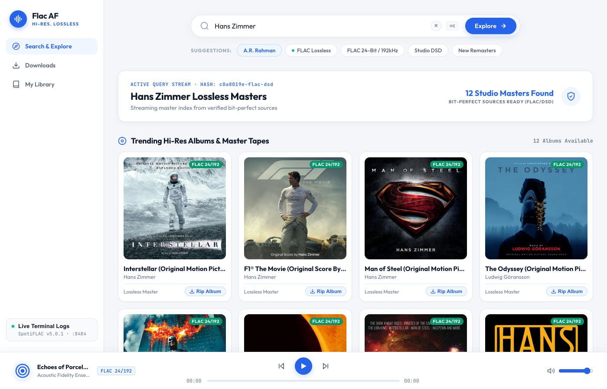
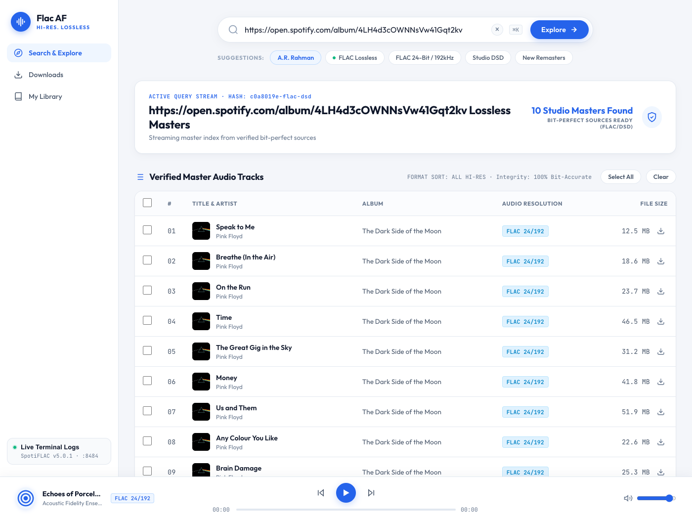

# Flac AF · Hi-Res Lossless Studio

<p align="center">
  
</p>

<p align="center">
  
  
  
  
  
</p>

**Flac AF Studio** is an open-source, self-hosted web dashboard and audio pipeline for audiophiles. It bridges intuitive music curation with true **16-bit / 44.1kHz up to 24-bit / 192kHz bit-perfect FLAC** streaming bridges (Tidal Web, Qobuz Web, Amazon Music, Deezer) — **without requiring paid subscriptions, user accounts, or private access tokens.**

Built for portable audio enthusiasts, DAPs (Digital Audio Players like Shanling, Sony Walkman, FiiO, HiBy, Astell&Kern), and offline lossless archival.

---

## ✨ Key Features

* **True Bit-Perfect Lossless Streams:** Downloads genuine FLAC audio matching ISRC recording codes directly from master providers (never lossy YouTube audio or transcode fakes).
* **Zero Login Required:** Fully stateless extension bridges — no accounts, cookies, or private credentials needed.
* **Audiophile Studio Light Interface:** Clean, high-contrast minimalist dashboard featuring real-time download progress, high-res album cards, and queue controls.
* **Built-in HTML5 Lossless Web Player:** Audition and preview downloaded FLACs and albums instantly in your browser before transferring to your gear.
* **Resilient Multi-Provider Fallback:** Automatic failover chain (`Tidal Web ➔ Qobuz Web ➔ Amazon Music ➔ Deezer`) guarantees maximum catalog availability.
* **DAP-Ready Organization:**
  * Embeds rich ID3/FLAC Vorbis tags (Artist, Album, Year, Track Number, Genre, ISRC).
  * Automatically extracts external high-res `cover.jpg` (required for hardware lockscreen display on MTouch / Android DAPs).
  * Automatically purges hidden system junk (`.DS_Store`, `._*` resource forks, temporary chunks).
* **One-Click Launch:** Pre-configured launchers for macOS, Linux, Windows, and Docker.

---

## 📸 Screenshots

### 1. Master Catalog & Search
Search for artists, soundtrack titles, or paste Spotify URLs to fetch lossless albums:
<p align="center">
  
</p>

### 2. Direct Spotify Link & Master Tracklist
Resolves tracklists, durations, and audio resolution badges (`FLAC 24/192`):
<p align="center">
  
</p>

---

## 🎯 Architecture & Philosophy

Flac AF Studio is built around three core principles:

1. **Uncompromised Stream Fidelity:**  
   Every stream is retrieved untouched in its original bit-depth and sample rate from public CDN endpoints. No lossy transcoding, no dynamic range compression, and no format conversion.
2. **Frictionless Zero-Config Operation:**  
   Users shouldn't have to manage API keys, configure session cookies, or renew streaming tokens. The stateless extension bridges run out of the box.
3. **Hardware Interoperability (DAP First):**  
   Music libraries should be clean and immediately usable on standalone audiophile players (microSD cards, car audio systems, offline DAPs) with zero manual file renaming or artwork stitching required.

---

## 🚀 Quickstart Guide

### Option 1: macOS & Linux (One-Click)

1. Clone this repository:
   ```bash
   git clone https://github.com/nnistala/flac-af-studio.git
   cd flac-af-studio
   ```
2. Run the launcher:
   ```bash
   chmod +x launch.sh
   ./launch.sh
   ```
   *The launcher automatically initializes a Python virtual environment, installs dependencies, starts the backend, and opens `http://localhost:8484` in your default browser.*

---

### Option 2: Windows (One-Click)

1. Clone or download this repository.
2. Double-click **`launch.bat`**.
   *The batch script initializes the local virtual environment and launches the studio in your browser.*

---

### Option 3: Docker (Recommended for NAS / Unraid / Synology)

Run with a single command without installing Python or dependencies on your host machine:

```bash
docker compose up -d
```

Or run via Docker directly:
```bash
docker run -d \
  --name flac-studio \
  -p 8484:8484 \
  -v ./downloads:/app/downloads \
  flac-af-studio
```

Access the studio at `http://localhost:8484`. All downloaded FLAC files will appear in your local `./downloads` folder.

---

### Option 4: Manual Setup

```bash
# 1. Create a Python 3.10+ virtual environment
python3 -m venv .venv
source .venv/bin/activate  # On Windows: .venv\Scripts\activate

# 2. Install requirements
pip install -r requirements.txt

# 3. Export provider extension registry
export SPOTIFLAC_REGISTRIES="https://raw.githubusercontent.com/spotiflacapp/spotiflac-extension/main/registry.json"

# 4. Start the server
python3 -m uvicorn server:app --host 127.0.0.1 --port 8484
```

---

## 🎧 Digital Audio Player (DAP) Best Practices

If you transfer your library to dedicated DAPs (e.g. **Shanling M1 Plus / M3 Ultra**, **Sony Walkman NW-A306 / ZX707**, **FiiO M11 / M15**, **HiBy R6**):

1. **Format MicroSD Card:** Use **`exFAT`** with **`Master Boot Record (MBR)`** (GPT can cause some DAP bootloaders to fail to detect the drive).
2. **Mac Users (Purge Ghost Files):** macOS automatically generates hidden `._*` resource fork files on exFAT cards. Run this command after transferring to prevent unplayable 4KB ghost tracks on your player:
   ```bash
   dot_clean -m /Volumes/<YOUR_SD_CARD_NAME>
   ```
3. **Artwork Guarantee:** Flac AF automatically writes an external `cover.jpg` inside every album directory for folder navigation and lockscreen rendering.

---

## 📜 Legal & Disclaimer

> [!IMPORTANT]
> **PLEASE READ CAREFULLY BEFORE USING THIS SOFTWARE:**
>
> 1. **Educational & Personal Archival Use Only:** This software is an experimental, non-commercial open-source project created strictly for educational purposes, personal research, and personal format-shifting / interoperability.
> 2. **No Content Hosted:** This software **does not host, store, cache, distribute, or stream any copyrighted audio, video, or media files**. It operates entirely as an open-source client utility running on your local machine. All audio queries and streams are resolved directly between the user's local client and public third-party endpoints.
> 3. **Third-Party Trademarks:** Spotify, Tidal, Qobuz, Amazon Music, Deezer, and other brand names are trademarks of their respective owners. This project is not affiliated, endorsed, or associated with any of these companies.
> 4. **No Commercial Use:** This project is provided free of charge under the open-source MIT License. Selling, renting, monetizing, or utilizing this software as a paid service is strictly prohibited.
> 5. **User Responsibility:** Users are solely responsible for ensuring their use of this software complies with all applicable local, national, and international copyright laws and third-party terms of service. The developers, contributors, and maintainers assume **no liability or responsibility** for any misuse, copyright infringement, or damages arising from the use of this software.

---

## 📄 License

Distributed under the **MIT License**. See [`LICENSE`](LICENSE) for complete terms.
